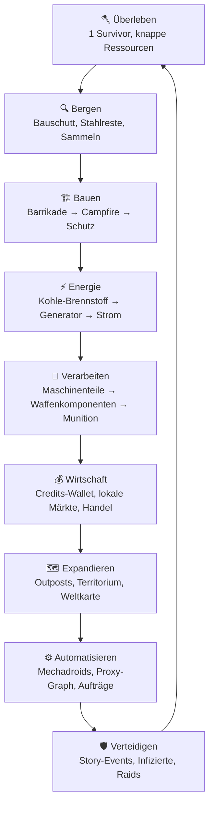
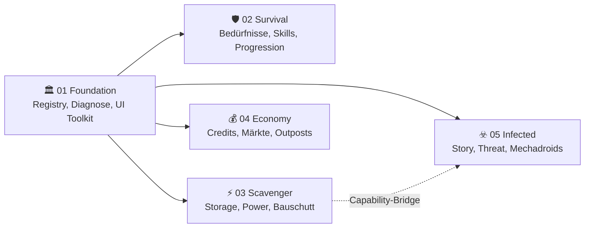
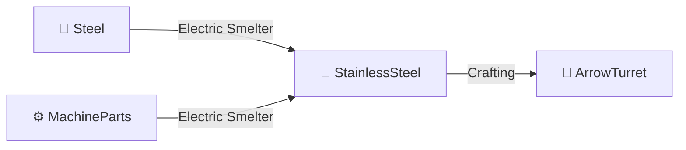
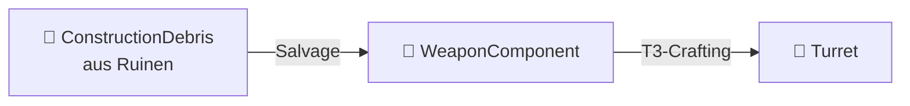
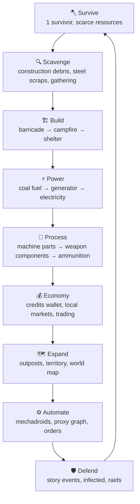
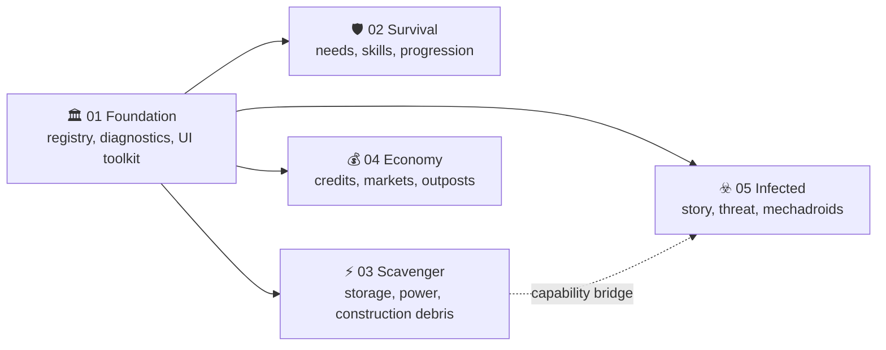
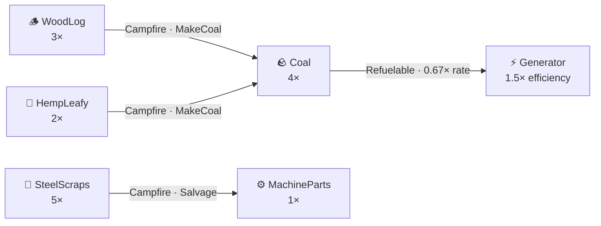
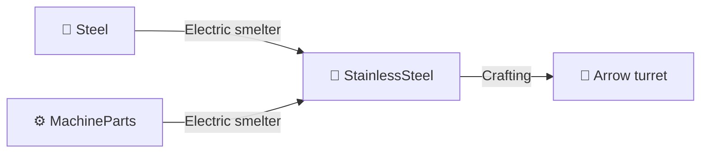
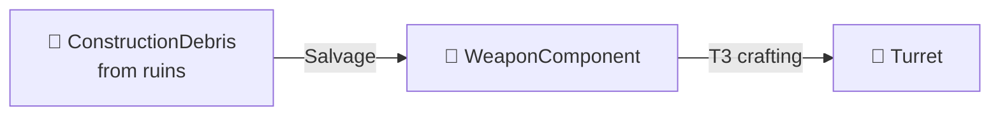

<p align="center">
  
</p>

<p align="center">
  <a href="https://github.com/vannon091118/Rimconemy/releases"></a>
  
  
  
  
  
</p>

<h1 align="center">RIMCONEMY</h1>

<p align="center">
  <em>Ein modularer Survival-Economy-Overhaul für RimWorld 1.6.</em><br/>
  <strong>Wachstum erzeugt Aufmerksamkeit. Das ist kein Bug. Das ist der Spielplan.</strong>
</p>

<p align="center">
  <a href="#-was-ist-rimconemy">Was ist Rimconemy?</a> ·
  <a href="#-der-überlebenskreislauf">Gameplay</a> ·
  <a href="#-die-fünf-pakete">Pakete</a> ·
  <a href="#-installation">Installation</a> ·
  <a href="#-der-maschinenraum">Entwickler</a> ·
  <a href="ROADMAP.md">Roadmap</a>
</p>

---

## 🏛️ Was ist Rimconemy?

Rimconemy verwandelt RimWorld in eine Überlebenssimulation, in der **Wirtschaft, Ökologie, Infrastruktur und Sozialdynamik** gemeinsam Druck erzeugen. Ressourcen sind physisch, Entscheidungen haben Folgekosten und Wachstum macht deine Kolonie sichtbarer.

> **Je stärker deine Basis wird, desto lauter fragt die Welt, ob du das wirklich durchdacht hast.**

Rimconemy ist **Pre-Alpha**. Alle fünf Pakete bauen, booten und laufen durch die dokumentierten Regression-Gates. Vollständige Live-Gameplay-Loops, Runtime-Save/Load und einige Weltkarten-Systeme sind weiterhin offen — genau ausgewiesen in der [Beleggrenze](docs/CODE_STATUS.md).

## 🎮 Der Überlebenskreislauf



### Spielphasen

| Phase | Name | Was sich ändert |
|---|---|---|
| 🪓 | **Überleben** | Ein Siedler, knappe Ressourcen, echte Prioritäten. Luxus ist: wenn nichts brennt. |
| 🏗️ | **Aufbauen** | Bauschutt wird zu Strukturen. Strom, Wasser und Brennstoff bleiben physische Systeme. |
| 💰 | **Wirtschaften** | Credits-Wallet, Silber als physisches Material und lokale Preise statt universeller Tauschlogik. |
| 🗺️ | **Expandieren** | Outposts, Weltkarte und Territorium. Mehr Besitz bedeutet mehr Arbeit und mehr Angriffsfläche. |
| ⚙️ | **Automatisieren** | Mechadroids, automatisierte Raids und ein Outpost-Proxy-Graph. |
| 🛡️ | **Verteidigen** | Deterministische Story-Events und Bedrohungsdruck mit erklärbaren Regeln. |

## 📦 Die fünf Pakete

Rimconemy besteht aus **fünf getrennten Paketen**. Feature-Pakete können separat aktiviert werden; Pakete mit Foundation-Abhängigkeit benötigen `01 Foundation`. Zusammen bilden sie das **Full-Overhaul-Profil**.



| Nr. | Paket | Verantwortung | Belegstatus |
|---|---|---|---|
| `01` | **🏛️ Foundation** | Registry, Diagnose, Capabilities, Save-Metadaten, UI-Toolkit, DLC-Filter | `COMPILES` · `BOOT` |
| `02` | **🛡️ Survival & Progression** | Charakter-Setup, Bedürfnisse, XP/Progression, Game-Over, Save-Migration | `COMPILES` · `BOOT` |
| `03` | **⚡ Scavenger Infrastructure** | Physische Lagerbestände, Power-Chain, Bauschutt, Building-Snapshots, Coal-Kette | `COMPILES` · `BOOT` |
| `04` | **💰 Economy & Territory** | Credits-Wallet, deterministische Märkte, Outposts, Territorium, Weltkarte | `COMPILES` · `BOOT` |
| `05` | **☣️ Infected & Automation** | Story-Director, Threat, Infizierte, Raids, Mechadroid-Aufträge | `COMPILES` · `BOOT` |

> **Package-Isolation:** Die Pakete haben keine Projekt-Referenzen untereinander. Cross-Package-Kommunikation läuft über versionierte Capabilities in Foundation.

## ⛓️ Ressourcenketten

### Coal Chain


### StainlessSteel Chain



### Bauschutt → Waffen-Komponente



## 🎮 Das Hub-Dashboard

Das Foundation-Hub bündelt die Read-Models der fünf Systeme:

- **🏛️ Kolonie** — Foundation-Status, DLC-Erkennung, Log und Paketübersicht
- **🛡️ Überleben** — Progression, Bedürfnisse und Ressourcen-Snapshot
- **⚡ Infrastruktur** — Power-Grid, Storage und Baufortschritt
- **💰 Wirtschaft** — Credits-Wallet, Märkte und Handelsaktionen
- **☣️ Bedrohung** — Threat-Pegel, Story-Snapshot und Dev-Auswertung

**Vanilla Quick-Nav:** Weltkarte, Quests, Forschung, Arbeit und Verlauf bleiben per Klick erreichbar, ohne den Hub schließen zu müssen.

## ✅ Status und Beleggrenze

| Gate | Status |
|---|---|
| RimWorld 1.6.4566 / 5 Pakete | ✅ Build gegen die Zielversion |
| Runtime-Boot / FullOverhaul | ✅ Foundation erkennt das Full-Profil |
| Regression-Summaries | ✅ 35+ dokumentierte Gates |
| Runtime Save/Load | 🔄 offen |
| Vollständige Event-/Raid-Auflösung | 🔄 offen |
| Kartenwechsel, Caravans, unloaded Storage | 🔄 offen |
| Vollständige Gameplay-Loops | ⬜ in Arbeit |

`CODE`, `DEF`, `COMPILES` oder `BOOT` sind kein Ersatz für `LIVE`. Die vollständige, code-nahe Statusreferenz steht in [`docs/CODE_STATUS.md`](docs/CODE_STATUS.md); die Falsifikationsberichte liegen unter [`docs/falsification/`](docs/falsification/).

## 🚀 Installation

| Voraussetzung | Details |
|---|---|
| **RimWorld** | 1.6.4566 |
| **Harmony** | Pflicht |
| **DLC** | Anomaly + Odyssey für Full-Overhaul; Royalty, Ideology und Biotech optional |

### Ladefolge

```text
Core / DLCs → Harmony → 01 Foundation → 02 Survival → 03 Scavenger → 04 Economy → 05 Infected
```

### Entwickler-Build

```bash
# Alle fünf Pakete bauen und deployen
./scripts/deploy.sh

# Installations- und Artefaktcheck ohne Spielstart
./scripts/runtime_test.sh --skip-start --no-deploy

# Vollständiger Runtime-Gate-Test
./scripts/runtime_test.sh --require-scenario-tests
```

## 🔧 Der Maschinenraum

Rimconemy ist nicht nur ein Modpack, sondern ein bewusst getrenntes System:

| Prinzip | Bedeutung |
|---|---|
| **Package-Isolation** | Fachliche Zuständigkeiten bleiben in fünf unabhängigen Paketen. |
| **Capability-System** | Optionale Features werden über versionierte Registry-Verträge abgefragt. |
| **Keine parallelen Wahrheiten** | UI, Story und Economy lesen physische Ressourcen aus demselben Storage-Read-Model. |
| **Save-Verträge** | Persistenter Zustand braucht Schema-Version, Migration und Roundtrip-Test. |
| **Determinismus** | Stabile Sortierung, explizite Seeds, nachvollziehbare Auswahlgründe und Idempotency-Keys. |
| **Harmony-Minimierung** | Defs/XML und native Components kommen vor Harmony-Patches. |

### Entwickler-Dokumente

- [`CONTRIBUTING.md`](CONTRIBUTING.md) — Build-, Test- und Review-Regeln
- [`docs/CODE_STATUS.md`](docs/CODE_STATUS.md) — CODE/DEF/COMPILES/BOOT/LIVE
- [`docs/ARCHITECTURE.md`](docs/ARCHITECTURE.md) — Architektur-Orientierung
- [`docs/INTERFACE_CONTRACT.md`](docs/INTERFACE_CONTRACT.md) — Capabilities und Paketgrenzen
- [`docs/SAVE_CONTRACT.md`](docs/SAVE_CONTRACT.md) — Schema-Versionierung und Migration
- [`docs/COMPATIBILITY_MATRIX.md`](docs/COMPATIBILITY_MATRIX.md) — RimWorld-/DLC-Kompatibilität
- [`ROADMAP.md`](ROADMAP.md) — Master-Plan und Backlog

### Paket-BLUEPRINTs

[01 Foundation](mods/01-Rimconemy-Foundation/BLUEPRINT.md) · [02 Survival](mods/02-Rimconemy-Survival-Progression/BLUEPRINT.md) · [03 Scavenger](mods/03-Rimconemy-Scavenger-Infrastructure/BLUEPRINT.md) · [04 Economy](mods/04-Rimconemy-Economy-Territory/BLUEPRINT.md) · [05 Infected](mods/05-Rimconemy-Infected-Automation/BLUEPRINT.md)

---

<p align="center">
  <strong>Rimconemy:</strong> Mehr Dashboards. Weniger Gewissheit. Aber mit Regressionstests.<br/>
  <em>Ein Projekt, das ehrlich darüber ist, was es noch nicht kann.</em>
</p>

<details>
<summary>🇬🇧 English version — click to expand</summary>

<p align="center">
  
</p>

<p align="center">
  <a href="https://github.com/vannon091118/Rimconemy/releases"></a>
  
  
  
  
  
</p>

<h1 align="center">RIMCONEMY</h1>

<p align="center">
  <em>A modular survival-economy overhaul for RimWorld 1.6.</em><br/>
  <strong>Growth attracts attention. That is not a bug. That is the game plan.</strong>
</p>

<p align="center">
  <a href="#english-what-is-rimconemy">What is Rimconemy?</a> ·
  <a href="#english-survival-loop">Gameplay</a> ·
  <a href="#english-five-packages">Packages</a> ·
  <a href="#english-installation">Installation</a> ·
  <a href="#english-machine-room">Developers</a> ·
  <a href="ROADMAP.md">Roadmap</a>
</p>

---

<a id="english-what-is-rimconemy"></a>

## 🏛️ What is Rimconemy?

Rimconemy turns RimWorld into a survival simulation where **economy, ecology, infrastructure, and social dynamics** create pressure together. Resources are physical, decisions carry follow-up costs, and growth makes your colony more visible.

> **The stronger your base becomes, the louder the world asks whether you really thought this through.**

Rimconemy is **pre-alpha**. All five packages build, boot, and pass the documented regression gates. Complete live gameplay loops, runtime save/load, and some world-map systems are still open — explicitly tracked in the [evidence boundary](docs/CODE_STATUS.md).

<a id="english-survival-loop"></a>

## 🎮 The survival loop



### Gameplay phases

| Phase | Name | What changes |
|---|---|---|
| 🪓 | **Survive** | One survivor, scarce resources, real priorities. Luxury means nothing is on fire. |
| 🏗️ | **Build** | Construction debris becomes structures. Power, water, and fuel remain physical systems. |
| 💰 | **Trade** | A credits wallet, silver as physical material, and local prices instead of universal exchange logic. |
| 🗺️ | **Expand** | Outposts, world map, and territory. More property means more work and more attack surface. |
| ⚙️ | **Automate** | Mechadroids, automated raids, and an outpost proxy graph. |
| 🛡️ | **Defend** | Deterministic story events and threat pressure with explainable rules. |

<a id="english-five-packages"></a>

## 📦 The five packages

Rimconemy consists of **five separated packages**. Feature packages can be enabled separately; packages that depend on Foundation require `01 Foundation`. Together they form the **Full Overhaul profile**.



| No. | Package | Responsibility | Evidence status |
|---|---|---|---|
| `01` | **🏛️ Foundation** | Registry, diagnostics, capabilities, save metadata, UI toolkit, DLC filtering | `COMPILES` · `BOOT` |
| `02` | **🛡️ Survival & Progression** | Character setup, needs, XP/progression, game over, save migration | `COMPILES` · `BOOT` |
| `03` | **⚡ Scavenger Infrastructure** | Physical storage, power chain, construction debris, building snapshots, coal chain | `COMPILES` · `BOOT` |
| `04` | **💰 Economy & Territory** | Credits wallet, deterministic markets, outposts, territory, world map | `COMPILES` · `BOOT` |
| `05` | **☣️ Infected & Automation** | Story director, threat, infected, raids, mechadroid orders | `COMPILES` · `BOOT` |

> **Package isolation:** The packages have no project references to one another. Cross-package communication uses versioned capabilities in Foundation.

## ⛓️ Resource chains

### Coal chain



### Stainless steel chain



### Construction debris → weapon component



## 🎮 The hub dashboard

The Foundation hub brings together the read models of all five systems:

- **🏛️ Colony** — Foundation status, DLC detection, log, and package overview
- **🛡️ Survival** — progression, needs, and resource snapshot
- **⚡ Infrastructure** — power grid, storage, and construction progress
- **💰 Economy** — credits wallet, markets, and trading actions
- **☣️ Threat** — threat level, story snapshot, and developer evaluation

**Vanilla quick navigation:** The world map, quests, research, work, and history remain one click away without closing the hub.

## ✅ Status and evidence boundary

| Gate | Status |
|---|---|
| RimWorld 1.6.4566 / 5 packages | ✅ Built against the target version |
| Runtime boot / Full Overhaul | ✅ Foundation detects the Full profile |
| Regression summaries | ✅ 35+ documented gates |
| Runtime save/load | 🔄 open |
| Complete event/raid resolution | 🔄 open |
| Map changes, caravans, unloaded storage | 🔄 open |
| Complete gameplay loops | ⬜ in progress |

`CODE`, `DEF`, `COMPILES`, or `BOOT` are not a replacement for `LIVE`. The complete code-facing status reference is [`docs/CODE_STATUS.md`](docs/CODE_STATUS.md); falsification reports are under [`docs/falsification/`](docs/falsification/).

<a id="english-installation"></a>

## 🚀 Installation

| Requirement | Details |
|---|---|
| **RimWorld** | 1.6.4566 |
| **Harmony** | Required |
| **DLC** | Anomaly + Odyssey for Full Overhaul; Royalty, Ideology, and Biotech optional |

### Load order

```text
Core / DLCs → Harmony → 01 Foundation → 02 Survival → 03 Scavenger → 04 Economy → 05 Infected
```

### Developer build

```bash
# Build and deploy all five packages
./scripts/deploy.sh

# Installation and artifact check without starting the game
./scripts/runtime_test.sh --skip-start --no-deploy

# Full runtime gate test
./scripts/runtime_test.sh --require-scenario-tests
```

<a id="english-machine-room"></a>

## 🔧 The machine room

Rimconemy is not only a mod pack; it is a deliberately separated system:

| Principle | Meaning |
|---|---|
| **Package isolation** | Domain ownership stays inside five independent packages. |
| **Capability system** | Optional features are queried through versioned registry contracts. |
| **No parallel truths** | UI, story, and economy read physical resources from the same storage read model. |
| **Save contracts** | Persistent state needs a schema version, migration, and roundtrip test. |
| **Determinism** | Stable sorting, explicit seeds, explainable selection reasons, and idempotency keys. |
| **Harmony minimization** | Defs/XML and native components come before Harmony patches. |

### Developer documents

- [`CONTRIBUTING.md`](CONTRIBUTING.md) — build, testing, and review rules
- [`docs/CODE_STATUS.md`](docs/CODE_STATUS.md) — CODE/DEF/COMPILES/BOOT/LIVE
- [`docs/ARCHITECTURE.md`](docs/ARCHITECTURE.md) — architecture orientation
- [`docs/INTERFACE_CONTRACT.md`](docs/INTERFACE_CONTRACT.md) — capabilities and package boundaries
- [`docs/SAVE_CONTRACT.md`](docs/SAVE_CONTRACT.md) — schema versioning and migration
- [`docs/COMPATIBILITY_MATRIX.md`](docs/COMPATIBILITY_MATRIX.md) — RimWorld/DLC compatibility
- [`ROADMAP.md`](ROADMAP.md) — master plan and backlog

### Package BLUEPRINTs

[01 Foundation](mods/01-Rimconemy-Foundation/BLUEPRINT.md) · [02 Survival](mods/02-Rimconemy-Survival-Progression/BLUEPRINT.md) · [03 Scavenger](mods/03-Rimconemy-Scavenger-Infrastructure/BLUEPRINT.md) · [04 Economy](mods/04-Rimconemy-Economy-Territory/BLUEPRINT.md) · [05 Infected](mods/05-Rimconemy-Infected-Automation/BLUEPRINT.md)

---

<p align="center">
  <strong>Rimconemy:</strong> More dashboards. Less certainty. But with regression tests.<br/>
  <em>A project honest about what it cannot do yet.</em>
</p>

</details>
