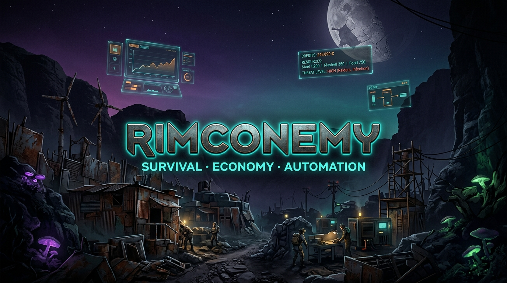

<p align="center">
  
</p>

<p align="center">
  <a href="https://github.com/vannon091118/Rimconemy/releases"></a>
  
  
  
  
</p>

<h1 align="center">RIMCONEMY</h1>

<p align="center">
  <em>Ein modularer Survival-Economy-Overhaul für RimWorld 1.6.</em><br/>
  <strong>Wachstum erzeugt Aufmerksamkeit. Das ist kein Bug. Das ist der Spielplan.</strong>
</p>

<p align="center">
  <a href="#-was-ist-rimconemy">Über das Mod</a> ·
  <a href="#-die-fünf-pakete">Pakete</a> ·
  <a href="#-installation">Installation</a> ·
  <a href="#-für-entwickler">Developer Guide</a> ·
  <a href="#-aktueller-stand">Status</a> ·
  <a href="ROADMAP.md">Roadmap</a>
</p>

---

## 🧭 Was ist Rimconemy?

Rimconemy ist ein **modularer RimWorld-Overhaul**, der das klassische Colony-Building mit einem echten Wirtschaftssystem, Story-Druck und deterministischer Automatisierung verknüpft. Alles dreht sich um einen einzigen Überlebenden, eine zerstörte Welt — und den klassischen Irrtum, man könne ein Problem lösen, indem man eine größere Basis baut.

> **Je stärker deine Basis wird, desto lauter fragt die Welt, ob du das wirklich durchdacht hast.**

Die Spielschleife führt vom Sammeln und Bauen über Wirtschaft und Expansion bis zu Story-Druck und Verteidigung:

```
🪓 Überleben → 🏗️ Aufbauen → 💰 Wirtschaften → 🗺️ Expandieren → ⚙️ Automatisieren → 🛡️ Verteidigen
```

| Schritt | Was das bedeutet |
|---|---|
| 🪓 **Überleben** | Ein Siedler, knappe Ressourcen, echte Prioritäten. Luxus ist zunächst: wenn nichts brennt. |
| 🏗️ **Aufbauen** | Bauschutt → Strukturen. Jeder Schritt kostet. Strom, Wasser, Treibstoff — kein magisches Grid. |
| 💰 **Wirtschaften** | Credits als Wallet, Silber als physisches Material. Lokale Preise statt universeller Tauschlogik. |
| 🗺️ **Expandieren** | Outposts, Weltkarte und Territorium. Mehr Besitz = mehr Arbeit = mehr Angriffsfläche. |
| ⚙️ **Automatisieren** | Mechadroids, automatisierte Raids, Outpost-Proxy-Graph — wenn du überlebt hast, fängst du an zu skalieren. |
| 🛡️ **Verteidigen** | Deterministische Story-Events, ideologische Reaktionen, Bedrohungsdruck mit erklärbaren Regeln. Und die Infizierten kommen sowieso. |

---

## 📦 Die fünf Pakete

Rimconemy ist in **5 unabhängige Pakete** aufgeteilt. Jedes Paket kann einzeln geladen werden; zusammen bauen sie das vollständige Overhaul-Profil auf.

<table>
<thead>
<tr>
<th>Nr.</th>
<th>Paket</th>
<th>Was es macht</th>
<th>Status</th>
</tr>
</thead>
<tbody>
<tr>
<td><code>01</code></td>
<td><strong>🏛️ Foundation</strong></td>
<td>Unified Hub-Dashboard, Diagnose, Eventlog, DLC-Erkennung, Vanilla Quick-Nav, gemeinsame Verträge</td>
<td>✅ BOOT</td>
</tr>
<tr>
<td><code>02</code></td>
<td><strong>🛡️ Survival &amp; Progression</strong></td>
<td>Bedürfnisse, Charakter-Setup, Arbeitserfahrung, Forschungspfad, Game-Over-Erkennung</td>
<td>✅ BOOT · Gates offen</td>
</tr>
<tr>
<td><code>03</code></td>
<td><strong>⚡ Scavenger Infrastructure</strong></td>
<td>Bauschutt, Lagerbestände, Farm-/Wasser-/Power-Grundlagen, Storage-Snapshots, Power-Chain</td>
<td>✅ BOOT · Loops offen</td>
</tr>
<tr>
<td><code>04</code></td>
<td><strong>💰 Economy &amp; Territory</strong></td>
<td>Credits-Wallet, lokale Märkte, Outposts, Weltkarte, Territorial-Expansion</td>
<td>✅ BOOT · Logistik offen</td>
</tr>
<tr>
<td><code>05</code></td>
<td><strong>☣️ Infected &amp; Automation</strong></td>
<td>Deterministische Story-Events, Infizierte, Mechadroids, Ideologie-Integration, Dev-Auswertung</td>
<td>✅ BOOT · Raids offen</td>
</tr>
</tbody>
</table>

> Die Paketgrenzen sind Absicht. Fünf kleine Probleme sind leichter zu debuggen als ein großes Problem mit fünf Logos.

---

## 🎮 Das Hub-Dashboard

Das **Rimconemy Hub-Fenster** ersetzt die 5 separaten Bottom-Bar-Buttons durch **einen einzigen Einstiegspunkt** — ohne RimWorlds native UI zu überfluten.

- **🏛️ Kolonie** — Foundation-Status, DLC-Erkennung, Log, Paketübersicht
- **🛡️ Überleben** — Progression, Bedürfnisse, Ressourcen-Snapshot
- **⚡ Infrastruktur** — Power-Grid, Storage, Baupfade
- **💰 Wirtschaft** — Credits-Wallet, Märkte, Live-Handelsaktionen
- **☣️ Bedrohung** — Threat-Pegel, Story-Snapshot, Dev-Auswertung

**Vanilla Quick-Nav:** Per Klick direkt in Weltkarte, Quests, Forschung, Arbeit oder Verlauf — ohne den Hub zu schließen.

---

## ✅ Aktueller Stand

> **Pre-Alpha:** Alle 5 Pakete bauen, booten und testen sauber. Ein vollständiger Gameplay-Loop-Nachweis steht noch aus.

| Bereich | Status |
|---|---|
| RimWorld 1.6.4566 Build | ✅ alle 5 Pakete kompilieren sauber |
| Runtime-Boot | ✅ Foundation erkennt Full-Overhaul-Profil |
| Hub-Dashboard (5 Sub-Tabs) | ✅ funktionsfähig |
| Vanilla Quick-Nav | ✅ funktionsfähig |
| Wallet / Credits | ✅ Lesen + Live-Handelskäufe/-verkäufe |
| Power-Grid-Scan | ✅ Vanilla-Generatoren werden erkannt |
| Story-Director (Dev-Mode) | ✅ manueller Trigger via Dev-Button |
| Ideologie-Regeln (H3) | ✅ CollectiveDefense + Transparency fertig |
| Character-Setup-State | ✅ code-fertig |
| Save/Load-Roundtrip | 🔄 offen |
| vollständige Gameplay-Loops | ⬜ in Arbeit |
| Raid-Auflösung live | ⬜ in Arbeit |

Die vollständige Beleggrenze: [`docs/CODE_STATUS.md`](docs/CODE_STATUS.md)

---

## 🚀 Installation

### Voraussetzungen

| Anforderung | Details |
|---|---|
| **RimWorld** | 1.6.4566 (Entwicklungsziel) |
| **Harmony** | Pflicht |
| **Anomaly + Odyssey DLC** | Pflicht für das Full-Overhaul-Profil |
| Royalty / Ideology / Biotech | Optional — über DLC-Policy behandelt |

### Ladefolge

```
Core / DLCs  →  Harmony  →  01 Foundation  →  02 Survival  →  03 Scavenger  →  04 Economy  →  05 Infected
```

### Lokaler Build (für Entwickler)

```bash
# Alle 5 Pakete bauen & direkt in RimWorld deployen
./scripts/deploy.sh

# Statischer Check ohne Spielstart
./scripts/runtime_test.sh --skip-start --no-deploy

# Vollständiger Runtime-Gate-Test
./scripts/runtime_test.sh
```

> **Hinweis:** Das Repository enthält Source-Code und Definitionen, keine vorkompilierten DLLs. Build erforderlich.

---

## 🔧 Für Entwickler

### Architektur

Rimconemy folgt dem Prinzip der **Package-Isolation**: Paket `01` kennt `02`–`05` nicht zur Compilezeit. Alle Cross-Package-Kommunikation läuft über:

- **Capability-System** (`CapabilityRegistry` in Foundation) — optionale Feature-Abfrage
- **Reflection-Loading** — für UI-Delegation ohne harte Assembly-Referenzen
- **Interface-Verträge** (`docs/INTERFACE_CONTRACT.md`) — maschinenlesbare API-Grenzen

### Wichtige Vertragsfiles

| Datei | Inhalt |
|---|---|
| [`docs/CODE_STATUS.md`](docs/CODE_STATUS.md) | Belegstufen (CODE / DEF / BUILD / BOOT / LIVE) |
| [`docs/DECISIONS.md`](docs/DECISIONS.md) | Warum das System bestimmte Dinge absichtlich *nicht* tut |
| [`docs/INTERFACE_CONTRACT.md`](docs/INTERFACE_CONTRACT.md) | Paketgrenzen und Capabilities |
| [`docs/SAVE_CONTRACT.md`](docs/SAVE_CONTRACT.md) | Save-Schema, Migration und kein stilles Vergessen |
| [`docs/COMPATIBILITY_MATRIX.md`](docs/COMPATIBILITY_MATRIX.md) | RimWorld-/DLC-Kompatibilität |
| [`CONTRIBUTING.md`](CONTRIBUTING.md) | Beitragsrichtlinien |
| [`ROADMAP.md`](ROADMAP.md) | Vollständiger Entwicklungsplan |

### Paket-BLUEPRINTs

Jedes Paket hat eine `BLUEPRINT.md` mit Eigentumsgrenzen, öffentlicher API und Falsifizierungsregeln:

[01 Foundation](mods/01-Rimconemy-Foundation/BLUEPRINT.md) · [02 Survival](mods/02-Rimconemy-Survival-Progression/BLUEPRINT.md) · [03 Scavenger](mods/03-Rimconemy-Scavenger-Infrastructure/BLUEPRINT.md) · [04 Economy](mods/04-Rimconemy-Economy-Territory/BLUEPRINT.md) · [05 Infected](mods/05-Rimconemy-Infected-Automation/BLUEPRINT.md)

---

## 🗺️ Roadmap (Kurzversion)

**Jetzt:**
- Save/Load-Roundtrip und Statusmigration verifizieren
- Storage-Snapshot über Kartenwechsel und Caravans absichern
- Story-Events bis zur Live-Ingame-Auflösung verifizieren

**Als Nächstes:**
- Bauschutt → Wand/Tür als erste sichtbare Gameplay-Mechanik
- Nahrung, Hanf, Wasser, Brennstoff, Strom als physische Pfade
- Character-Setup-Save-State und Generator-Gates abschließen

**Später, wenn die Infizierten zustimmen:**
- Echte Infizierten-Raids und Mechadroid-Aufträge
- Outposts, Proxy-Graph und Weltkarten-Endgame
- Automatisierte Raids und die Art von Logistik, die aus „nur ein kleiner Außenposten" eine neue Vollzeitstelle macht

→ **[Vollständige Roadmap](ROADMAP.md)**

---

## 🤝 Beitragen

Neue Beiträge bitte zuerst [`CONTRIBUTING.md`](CONTRIBUTING.md) lesen. Das Wichtigste in Kürze:

- Paket-Grenzen respektieren — kein harter Assembly-Verweis von `01` auf `02`–`05`
- Jede neue öffentliche API braucht einen Eintrag in `INTERFACE_CONTRACT.md`
- Neue Live-Belege in `docs/falsification/` dokumentieren
- Build muss sauber bleiben: `./scripts/deploy.sh` vor dem PR

---

<p align="center">
  <strong>Rimconemy:</strong> Mehr Dashboards. Weniger Gewissheit. Aber mit Regressionstests.<br/>
  <em>Ein Projekt, das ehrlich darüber ist, was es noch nicht kann.</em>
</p>
