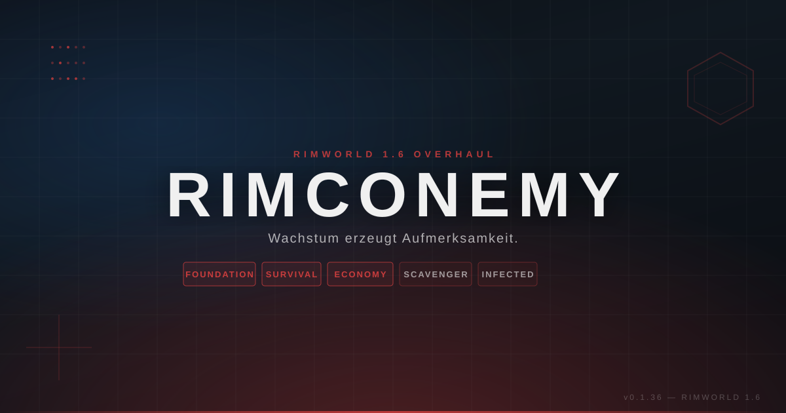

# Rimconemy

<p align="center"><a href="banner.html"></a></p>

<p align="center">
  <strong>Ein modularer Survival-Economy-Overhaul für RimWorld 1.6.</strong><br>
  Wachstum erzeugt Aufmerksamkeit. Das ist kein Bug. Das ist der Spielplan.
</p>

> **Status: Pre-Alpha — aktiv in Entwicklung**
>
> Die fünf Pakete bauen, booten und testen bereits. Ein vollständiger Save/Load- und Gameplay-Nachweis ist noch nicht überall angekommen. Bring also Neugier mit. Eine Ersatzkolonie schadet ebenfalls nicht.

## Was ist Rimconemy?

Rimconemy ist ein modularer RimWorld-Overhaul über einen einzelnen Überlebenden, eine zerstörte Welt und den klassischen Irrtum, man könne ein Problem lösen, indem man eine größere Basis baut.

Die geplante Spielschleife führt vom Sammeln und Bauen über Wirtschaft und Expansion zu Story-Druck und Verteidigung. Bereits vorhandene Read-Models und Verträge bilden dafür das Fundament; mehrere sichtbare Gameplay-Loops sind jedoch noch in Entwicklung und nicht als vollständiges Live-Verhalten belegt. Deine Lagerbestände sollen echte Spielwelt-Bestände bleiben, deine Investitionen sollen sichtbare Kosten haben und dein Wachstum soll die Welt interessieren. Die Infizierten haben dafür ihren eigenen Story-Druck. Sie sind nicht eingeladen worden. Sie kommen trotzdem.

Die Leitidee lautet:

> **Je stärker deine Basis wird, desto lauter fragt die Welt, ob du das wirklich durchdacht hast.**

## Was erwartet dich?

```text
Überleben → Aufbauen → Wirtschaften → Expandieren → Automatisieren → Verteidigen
```

- **Überleben:** ein Siedler, knappe Ressourcen, echte Prioritäten. Luxus ist zunächst, wenn nichts brennt.
- **Aufbauen:** geplante Pfade von Bauschutt, Farmen, Wasser, Brennstoff und Strom zur Verteidigung — derzeit mit unterschiedlichen Belegstufen.
- **Wirtschaften:** Credits als Wallet, Silber als physisches Material und lokale Preise statt magischer Allzweckökonomie.
- **Expandieren:** Outposts, Weltkarte und Territorium — als Zielbild mit der beruhigenden Aussicht, dass mehr Besitz auch mehr Arbeit bedeutet.
- **Druck aushalten:** deterministische Story-Ereignisse, ideologische Reaktionen und Bedrohungsdruck mit erklärbaren Regeln.
- **Irgendwann verlieren:** Game Over ist kein Ausnahmefall, sondern ein Teil des Designs. Das Spiel zählt mit. Es vergisst nichts. Meistens.

## Aktueller Stand: ehrlich, weil die Kolonie schon genug lügt

Die Projektstatus-Sprache unterscheidet bewusst zwischen **Code**, **Def**, **Build**, **Boot** und **Live-Spiel**. Ein erfolgreicher Build ist noch kein Beweis dafür, dass dein Kolonist gerade eine Wand gebaut hat. Er ist zunächst nur ein sehr überzeugender Beweis dafür, dass der Compiler nicht gewonnen hat.

| Bereich | Status | Was belegt ist |
|---|---|---|
| Fünf Mod-Pakete | ✅ vorhanden | Foundation, Survival, Scavenger, Economy und Infected sind im Repository und für das Full Profile vorgesehen |
| RimWorld 1.6 Build | ✅ belegt | lokale Builds gegen RimWorld 1.6.4566 |
| Runtime-Boot | ✅ belegt | alle fünf Mods laden, Foundation erkennt das Full-Overhaul-Profil |
| Regressionen | ✅ belegt | paketinterne Boot-Regressionen und Status-Summaries laufen |
| Ideology-Regeln 2 + 3 (H3) | ✅ code-fertig | CollectiveDefense + Transparency (ThoughtDefs, Tracker, PreceptDef, Regression-Tests) |
| Setting-/Erfahrungsfenster (H3) | ✅ code-fertig | SettingRulesCatalog + SettingRulesInspector |
| Caravan-Erweiterung (H4 §4) | ✅ code-fertig | StorageQuery.AllMapsIncludingCaravans + Sentinel-MapIds |
| Character-Setup-Save-State | ✅ code-fertig | CharacterSetupState GameComponent + Schema-Version |
| Vanilla-/DLC-Incident-Klassifikation | ✅ code-fertig | IncidentClassifier + One-Infected-Provider-Validator |
| P6 Gameplay-Scaffolding | ✅ code-fertig | Bauschutt-Remap, Food/Hemp, Generator-Fuel, Turret-Power-Gate, InfectedRaid-Spawn, Mechadroid-Registry, Outpost-Proxy-Graph, World-Raids |
| Save/Load-Roundtrip | 🔄 offen | vollständige Persistenz über alle relevanten Zustände noch nicht live verifiziert |
| Kartenwechsel/Caravans | 🔄 offen | unloaded Maps und temporäre Maps sind noch ein eigenes Gate |
| Event-/Raid-Ausführung | 🔄 offen | Auswahl und Adapter sind vorhanden; vollständige Live-Auflösung ist noch nicht überall belegt |
| vollständige Gameplay-Loops | ⬜ in Arbeit | Mechaniken sind Code-Scaffolds; Live-Belege in den 20 Falsifizierungsberichten `docs/falsification/` ausstehend |

Die vollständige Beleggrenze steht in [`docs/CODE_STATUS.md`](docs/CODE_STATUS.md). Dort wird nicht aus einem grünen Compiler ein goldener Spielstand gemacht.

## Installation für Spieler

### Voraussetzungen

- **RimWorld 1.6** — Entwicklungsziel ist RimWorld **1.6.4566**.
- **Harmony**.
- **Anomaly** und **Odyssey** — für das Foundation-basierte Rimconemy-Full-Profile derzeit harte Voraussetzungen.
- Royalty, Ideology und Biotech sind keine globalen Hard-Requires; ihre Inhalte werden über die dokumentierte DLC-Policy behandelt.

### Ladefolge

Baue zuerst die Pakete lokal über den Developer-Workflow. Kopiere anschließend die erzeugten Modordner in deinen RimWorld-Modordner und halte diese Reihenfolge ein:

```text
Core / DLCs
  ↓
Harmony
  ↓
Rimconemy Foundation
  ↓
Rimconemy Survival & Progression
  ↓
Rimconemy Scavenger Infrastructure
  ↓
Rimconemy Economy & Territory
  ↓
Rimconemy Infected & Automation
```

Das Repository ist derzeit ein **Source-/Pre-Alpha-Stand**: fertige DLLs werden nicht eingecheckt. Du kannst die Pakete lokal mit dem Developer-Workflow bauen und anschließend die erzeugten Modordner installieren; ein fertiges Release- oder Workshop-Paket ist hier nicht enthalten. Die Paketordner stehen unter [`mods/`](mods/), die jeweiligen `About.xml`-Dateien enthalten die maschinenlesbaren Paket-IDs und Ladebeziehungen. Für DLC-Kombinationen und bekannte Grenzen siehe die [`Kompatibilitätsmatrix`](docs/COMPATIBILITY_MATRIX.md).

> **Pre-Alpha-Hinweis:** Das Repository ist Entwicklungssoftware und kein fertiger Download. Wenn ein System noch als `BOOT` und nicht als `LIVE` markiert ist, bedeutet das: Es wurde sauber gestartet — nicht, dass es bereits deine Kolonie rettet.

## Die fünf Pakete

| Paket | Für Spieler | Öffentlicher Status |
|---|---|---|
| **01 Foundation** | Dashboard, Diagnose, Eventlog und gemeinsame Verträge | CODE · DEF · COMPILES · BOOT |
| **02 Survival & Progression** | Bedürfnisse, Charakter-Setup, Arbeitserfahrung, Forschung und Game-Over-Pfad | CODE · DEF · COMPILES · BOOT; Live-Gates offen |
| **03 Scavenger Infrastructure** | Bauschutt, Lagerbestände, Farm-/Wasser-/Power-Grundlagen und Gebäudedaten | CODE · DEF · COMPILES · BOOT; echte Verbrauchsloops offen |
| **04 Economy & Territory** | Credits, lokale Märkte, Outposts und Weltkarten-/Territoriumspfad | CODE · DEF · COMPILES · BOOT; vollständige Logistik offen |
| **05 Infected & Automation** | Story-Druck, Infizierte und Mechadroid-/Automationspfade | CODE · DEF · COMPILES · BOOT; vollständige Raid-Auflösung offen |

Die Paketgrenzen sind Absicht. Fünf kleine Probleme sind leichter zu diagnostizieren als ein großes Problem mit fünf Logos.

## Roadmap

### Jetzt

- Save/Load-Roundtrip und Statusmigration belastbar nachweisen.
- Storage-Snapshot über Kartenwechsel, Caravans und temporäre Maps absichern.
- Story-Events vom Auswahlmodell bis zur echten Ingame-Auflösung verifizieren.
- Setting-/Erfahrungsfenster und weitere Ideologie-Regeln sauber anbinden.

### Als Nächstes

- Bauschutt → Wand/Tür als erste sichtbare Gameplay-Mechanik.
- Nahrung, Hanf, Wasser, Brennstoff und Strom als echte physische Pfade.
- Character-Setup-Save-State und Generator-API-Gates abschließen.
- Vanilla-, DLC- und Infizierten-Incidents getrennt klassifizieren.

### Später, wenn die Infizierten zustimmen

- echte Infizierten-Raids und Mechadroid-Aufträge;
- Outposts, Proxy-Graph und Weltkarten-Endgame;
- automatisierte Raids und die Art von Logistik, die aus „nur ein kleiner Außenposten“ eine neue Vollzeitstelle macht.

Die vollständige technische Aufgabenliste steht in [`ROADMAP.md`](ROADMAP.md).

## Für Entwickler

Die kurze Variante:

```bash
# Build + Deploy aller fünf Pakete in die lokale RimWorld-Installation
./scripts/deploy.sh --all

# Statischer Installations-/Artefaktcheck ohne Spielstart
./scripts/runtime_test.sh --skip-start --no-deploy

# Vollständiger Runtime-Gate-Test, sofern die lokale Installation passt
./scripts/runtime_test.sh
```

`deploy.sh` ist der kanonische Deploypfad. Der vollständige Runtime-Test startet RimWorld, erzeugt einen frischen `Player.log` und prüft die registrierten Pakete sowie Regression-Summaries. Er ersetzt keinen interaktiven Save/Load- oder Gameplay-Test — selbst ein sehr motivierter Logfile kann keine Wand bauen.

Neue Beiträge sollten zuerst [`CONTRIBUTING.md`](CONTRIBUTING.md) lesen. Die Architektur- und Persistenzverträge sind hier verlinkt:

- [`docs/CODE_STATUS.md`](docs/CODE_STATUS.md) — Belegstufen und Paketstatus
- [`docs/DECISIONS.md`](docs/DECISIONS.md) — warum das System bestimmte Dinge absichtlich nicht tut
- [`docs/INTERFACE_CONTRACT.md`](docs/INTERFACE_CONTRACT.md) — Paketgrenzen und Capabilities
- [`docs/SAVE_CONTRACT.md`](docs/SAVE_CONTRACT.md) — Save-Schema, Migration und kein stilles Vergessen
- [`docs/COMPATIBILITY_MATRIX.md`](docs/COMPATIBILITY_MATRIX.md) — RimWorld-/DLC-Kompatibilität

## Dokumentation

- [`ROADMAP.md`](ROADMAP.md) — kanonischer Entwicklungsplan
- [`01 Foundation BLUEPRINT`](mods/01-Rimconemy-Foundation/BLUEPRINT.md), [`02 Survival BLUEPRINT`](mods/02-Rimconemy-Survival-Progression/BLUEPRINT.md), [`03 Scavenger BLUEPRINT`](mods/03-Rimconemy-Scavenger-Infrastructure/BLUEPRINT.md), [`04 Economy BLUEPRINT`](mods/04-Rimconemy-Economy-Territory/BLUEPRINT.md), [`05 Infected BLUEPRINT`](mods/05-Rimconemy-Infected-Automation/BLUEPRINT.md) — Eigentumsgrenzen und technische Paketverträge
- [`docs/superpowers/specs/`](docs/superpowers/specs/) — freigegebene Designs
- [`docs/superpowers/plans/`](docs/superpowers/plans/) — Umsetzungspläne

Rimconemy: **Mehr Dashboards. Weniger Gewissheit. Aber mit Regressionstests.**
