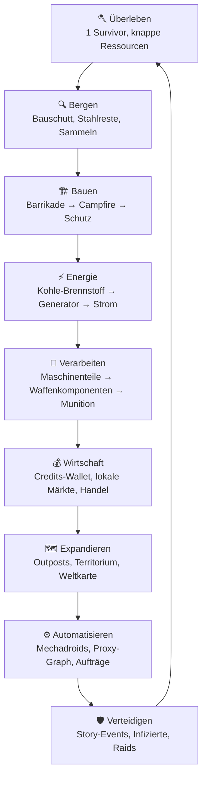
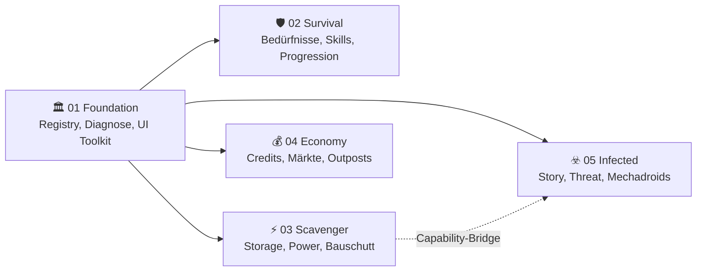
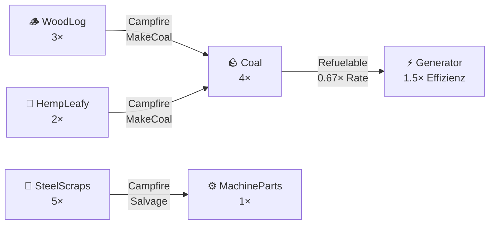
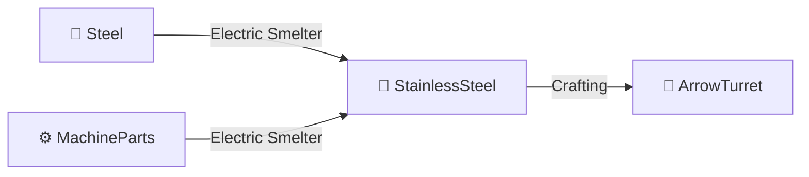
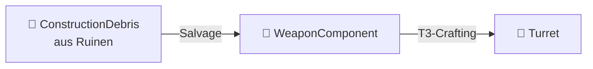

<p align="center">
  
</p>

<p align="center">
  <a href="https://github.com/vannon091118/Rimconemy/releases"></a>
  
  
  
  
  
</p>

<h1 align="center">RIMCONEMY</h1>

<p align="center">
  <em>Ein modularer Survival-Economy-Overhaul für RimWorld 1.6.</em><br/>
  <strong>Wachstum erzeugt Aufmerksamkeit. Das ist kein Bug. Das ist der Spielplan.</strong>
</p>

<p align="center">
  <a href="#-gameplay-loop">Gameplay Loop</a> ·
  <a href="#-pakete">Pakete</a> ·
  <a href="#-ressourcenketten">Ressourcen</a> ·
  <a href="#-installation">Installation</a> ·
  <a href="#-status">Status</a> ·
  <a href="ROADMAP.md">Roadmap</a>
</p>

---

## 🎮 Gameplay Loop



### Spielphasen

| Phase | Name | Beschreibung |
|---|---|---|
| 🪓 | **Überleben** | Ein Siedler, knappe Ressourcen, echte Prioritäten. Luxus ist: wenn nichts brennt. |
| 🏗️ | **Aufbauen** | Bauschutt → Strukturen. Strom, Wasser, Brennstoff — kein magisches Grid. |
| 💰 | **Wirtschaften** | Credits-Wallet, Silber als physisches Material. Lokale Preise statt universeller Tauschlogik. |
| 🗺️ | **Expandieren** | Outposts, Weltkarte, Territorium. Mehr Besitz = mehr Arbeit = mehr Angriffsfläche. |
| ⚙️ | **Automatisieren** | Mechadroids, automatisierte Raids, Outpost-Proxy-Graph. |
| 🛡️ | **Verteidigen** | Deterministische Story-Events, Bedrohungsdruck mit erklärbaren Regeln. |

---

## 🏛️ Vision

Rimconemy verwandelt RimWorld in eine tiefgreifende Überlebenssimulation, in der jedes Entscheidungsgewicht trägt. Emergente Narrative entstehen aus der Interaktion von **Wirtschaft, Ökologie und Sozialdynamik** — kein RNG ohne Erklärung, kein Wachstum ohne Aufmerksamkeit.

> **Je stärker deine Basis wird, desto lauter fragt die Welt, ob du das wirklich durchdacht hast.**

---

## 📦 Pakete

Rimconemy ist in **5 unabhängige Pakete** aufgeteilt. Jedes Paket kann einzeln geladen werden; zusammen bilden sie das **Full-Overhaul-Profil**.



| Nr. | Paket | Verantwortung | Status |
|---|---|---|---|
| `01` | **🏛️ Foundation** | Registry, Diagnose, Capabilities, Save-Metadaten, UI-Toolkit, DLC-Filter, ColonialReader | ✅ BOOT |
| `02` | **🛡️ Survival & Progression** | Charakter-Setup (Alter 18, Skill-Budget, Traits), Bedürfnisse, XP-Baum, Game-Over, Save-Migration | ✅ BOOT |
| `03` | **⚡ Scavenger Infrastructure** | Physische Lagerbestände (StorageSnapshot), Power-Chain (Generator→Netz), Bauschutt, Building-Snapshots, Coal-Kette | ✅ BOOT |
| `04` | **💰 Economy & Territory** | Credits-Wallet (Ledger), deterministische Märkte, Outposts (State-Machine), Territorium, Weltkarte | ✅ BOOT |
| `05` | **☣️ Infected & Automation** | Story-Director (deterministisch), Threat-Aggregator, Infizierten-Raids, Mechadroid-Aufträge, Ideologie-Adapter | ✅ BOOT |

> **Package-Isolation:** Keine Projekt-Referenzen zwischen den Paketen. Cross-Package-Kommunikation läuft über das **Capability-System** in Foundation.

---

## ⛓️ Ressourcenketten

### Coal Chain (P0 — implementiert)



### StainlessSteel Chain (P1 — implementiert)



### Bauschutt → Waffen-Komponente



---

## 🎮 Das Hub-Dashboard

- **🏛️ Kolonie** — Foundation-Status, DLC-Erkennung, Log, Paketübersicht
- **🛡️ Überleben** — Progression, Bedürfnisse, Ressourcen-Snapshot
- **⚡ Infrastruktur** — Power-Grid, Storage, Baufortschritt
- **💰 Wirtschaft** — Credits-Wallet, Märkte, Live-Handelsaktionen
- **☣️ Bedrohung** — Threat-Pegel, Story-Snapshot, Dev-Auswertung

**Vanilla Quick-Nav:** Per Klick in Weltkarte, Quests, Forschung, Arbeit oder Verlauf — ohne den Hub zu schließen.

---

## ✅ Status

> **Pre-Alpha:** Alle 5 Pakete bauen, booten und testen sauber. 35+ Regression-Test-Summaries grün. `runtime_test.sh`-Gate: **PASS**.

| Bereich | Status |
|---|---|
| RimWorld 1.6.4566 Build | ✅ 5/5 Pakete |
| Runtime-Boot | ✅ FullOverhaul erkannt |
| Hub-Dashboard (5 Tabs) | ✅ funktionsfähig |
| Vanilla Quick-Nav | ✅ funktionsfähig |
| Credits-Wallet | ✅ Lesen + Live-Handel |
| Power-Grid-Scan | ✅ Vanilla-Generatoren erkannt |
| Story-Director | ✅ deterministisch, 8 Events |
| Ideologie-Regeln (3) | ✅ ResourceFairness, CollectiveDefense, Transparency |
| Character-Setup | ✅ Alter 18, Skill-Budget 30, Trait-Zuweisung |
| Rollen-System | ✅ Animals/Artistic → Hunting/Smithing, BuilderDurability |
| Cooking-System | ✅ CookSkill-Comp, MealSimple/Fine/Lavish/SurvivalPack |
| ISchemaMigratable | ✅ 4 Pakete + Walker + Registry |
| Coal Chain (MakeCoal, Salvage) | ✅ DEF + Rezepte + Generator |
| StainlessSteel Chain | ✅ DEF + Rezepte + Turret |
| Save/Load-Roundtrip (Logic-Tests) | ✅ T1–T6 in 4 Paketen |
| Save/Load-Roundtrip (Runtime) | 🔄 offen |
| Vollständige Gameplay-Loops | ⬜ in Arbeit |
| Fog-of-War (Sprint 2) | 🔄 ChunkController + InfectedBehavior (Dormant→Roaming→Investigating→Assault) |
| Raid-Auflösung live | 🔄 Sprint 2 — ChunkController, Fog-of-War, Infected-Behavior-State-Machine |

→ **[Vollständige Beleggrenze](docs/CODE_STATUS.md)** · **[Falsifikations-Berichte](docs/falsification/README.md)**

---

## 🚀 Installation

| Voraussetzung | Details |
|---|---|
| **RimWorld** | 1.6.4566 |
| **Harmony** | Pflicht |
| **DLC** | Anomaly + Odyssey für Full-Overhaul; Royalty/Ideology/Biotech optional |

### Ladefolge

```
Core / DLCs → Harmony → 01 Foundation → 02 Survival → 03 Scavenger → 04 Economy → 05 Infected
```

### Developer Build

```bash
# Alle 5 Pakete bauen & deployen
./scripts/deploy.sh

# Statischer Check (kein Spielstart)
./scripts/runtime_test.sh --skip-start --no-deploy

# Vollständiger Runtime-Gate (RimWorld-Boot + 35+ Regression-Summaries)
./scripts/runtime_test.sh
```

---

## 🔧 Für Entwickler

### Architektur

| Prinzip | Beschreibung |
|---|---|
| **Package-Isolation** | Keine Compile-Abhängigkeiten zwischen 02–05 |
| **Capability-System** | Feature-Abfrage via `HasCapabilityOrWarn()` |
| **DLL-Cross-Ref** | Nur `<Reference>` auf Foundation.dll, kein ProjectReference |
| **Harmony-Minimierung** | `Defs/XML` > `StaticConstructorOnStartup` > `GameComponent` > `Harmony` |

### Wichtige Docs

| Datei | Inhalt |
|---|---|
| [`CODE_STATUS.md`](docs/CODE_STATUS.md) | Belegstufen (CODE/DEF/COMPILES/BOOT/LIVE) |
| [`DECISIONS.md`](docs/DECISIONS.md) | Architekturentscheidungen mit Begründung |
| [`INTERFACE_CONTRACT.md`](docs/INTERFACE_CONTRACT.md) | Capabilities, Package-Grenzen |
| [`SAVE_CONTRACT.md`](docs/SAVE_CONTRACT.md) | Schema-Versionierung, Migration, kein stilles Vergessen |
| [`COMPATIBILITY_MATRIX.md`](docs/COMPATIBILITY_MATRIX.md) | RimWorld-/DLC-Kompatibilität |
| [`ROADMAP.md`](ROADMAP.md) | Entwicklungsplan |

### Paket-BLUEPRINTs

[01 Foundation](mods/01-Rimconemy-Foundation/BLUEPRINT.md) · [02 Survival](mods/02-Rimconemy-Survival-Progression/BLUEPRINT.md) · [03 Scavenger](mods/03-Rimconemy-Scavenger-Infrastructure/BLUEPRINT.md) · [04 Economy](mods/04-Rimconemy-Economy-Territory/BLUEPRINT.md) · [05 Infected](mods/05-Rimconemy-Infected-Automation/BLUEPRINT.md)

---

<p align="center">
  <strong>Rimconemy:</strong> Mehr Dashboards. Weniger Gewissheit. Aber mit Regressionstests.<br/>
  <em>Ein Projekt, das ehrlich darüber ist, was es noch nicht kann.</em>
</p>
