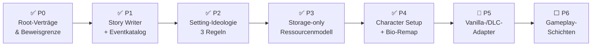
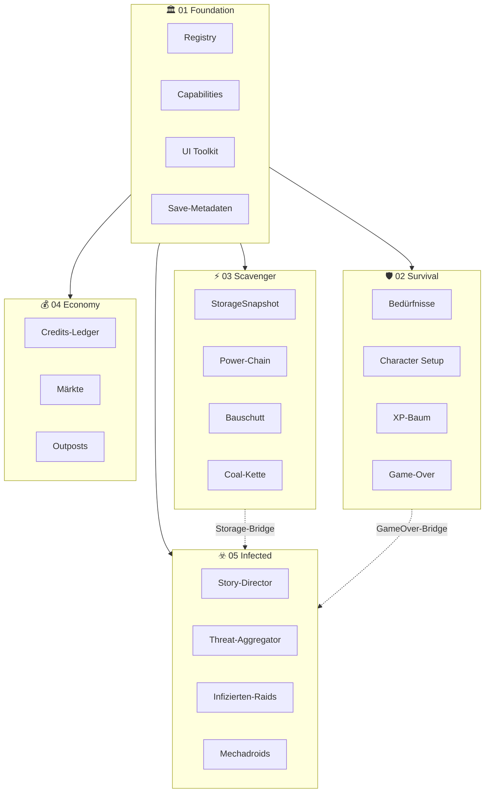
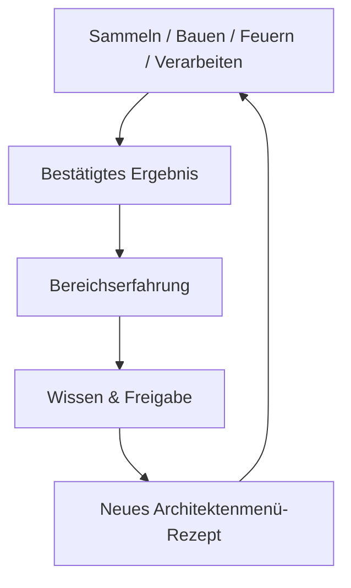

# Rimconemy — Root Roadmap

> **SSOT-Owner für:** Master-Plan, 5-Paket-Übersicht, Phase-Hierarchie, Paket-Identitäten, Backlog.
> **Stand:** 2026-08-06
> **Zielplattform:** RimWorld 1.6.4566; Royalty, Ideology, Biotech, Anomaly, Odyssey
> **Status:** Phase 1 Coding-Cut mit Runtime-Boot-Gates belegt. Alle 5 Mods laden, Foundation erkennt FullOverhaul, alle Bootstraps und Regression-Summaries laufen; `runtime_test.sh`: **PASS** (35+ Summaries, 0 Failures).
>
> **Operativer Plan:** → [WORKPLAN.md](docs/WORKPLAN.md) (kristallisierter Master-Plan, DELETE → WIRE → NEW)
>
> **Pro Mod (Abhängigkeitsmatrix + Stand + Roadmap):**
> [01-Foundation](mods/01-Rimconemy-Foundation/MOD_INDEX.md) ·
> [02-Survival](mods/02-Rimconemy-Survival-Progression/MOD_INDEX.md) ·
> [03-Scavenger](mods/03-Rimconemy-Scavenger-Infrastructure/MOD_INDEX.md) ·
> [04-Economy](mods/04-Rimconemy-Economy-Territory/MOD_INDEX.md) ·
> [05-Infected](mods/05-Rimconemy-Infected-Automation/MOD_INDEX.md)

---

## 🗺️ Phasen-Übersicht



---

## 📐 Architektur



---

## 1. Verbindliche Priorität

```text
Story Writer + Difficulty + Eventkatalog
        ↓
Setting-Ideologie als Verhaltensadapter
        ↓
Storage-only-Ressourcen-Snapshot
        ↓
Character Setup: Bio → Skillbudget → Traits
        ↓
Vanilla-/DLC-Adapter und echte Gameplay-Events
        ↓
Wirtschaft, Outposts, Infizierte, Mechadroids und Endgame
```

---

## 2. Produktentscheidungen

### 2.1 Story-Modell

Der Story Writer bewertet eine dynamische Lage und wählt daraus ein passendes Ereignis. Er ist ein **Setting-Director mit Vanilla-Adaptern**.

### 2.2 Difficulty-Profile

| Profil-ID | Bedeutung | Eventdruck | Ressourcen | Ruhefenster |
|---|---|---|---|---|
| `Rimconemy_Refuge` | Kleine Zuflucht | Niedrig | Grundversorgung verfügbar | Lang |
| `Rimconemy_Survival` | Hartes Überleben | Mittel | Lagerbestand entscheidend | Mittel |
| `Rimconemy_Collapse` | Zusammenbruch | Hoch | Keine kostenlose Erholung | Kurz |

### 2.3 Eventkatalog (8 Story-Events)

| Event-ID | Familie | Folge |
|---|---|---|
| `rimconemy_supply_bountiful_harvest` | Versorgung | Moral↑, Ressourcen+ |
| `rimconemy_supply_shortage` | Versorgungskrise | Lagerentscheidung |
| `rimconemy_raid_pirate_scouts` | Äußere Bedrohung | Warnung → Raid |
| `rimconemy_raid_mech_swarm` | Äußere Bedrohung | Mechanoiden-Angriff |
| `rimconemy_collapse_betrayal` | Ideologischer Konflikt | Kolonist verrät Gruppe |
| `rimconemy_collapse_epidemic` | Krise | Seuchen-Ausbruch |
| `rimconemy_opportunity_leadership_challenge` | Moralische Entscheidung | Führungswechsel |
| `rimconemy_opportunity_wanderer_arrives` | Entdeckung | Neuer Kolonist |

### 2.4 Setting-Ideologie (3 Regeln)

| Regel | Träger | Wirkung |
|---|---|---|
| `ResourceFairness` | ThoughtWorker | Ressourcen-Verteilung → Mood |
| `CollectiveDefense` | RoleDef + ThoughtDef | Gemeinsame Verteidigung → Zusammenhalt |
| `Transparency` | PreceptDef + ThoughtDef | Erklärte Entscheidungen → Vertrauen |

### 2.5 Erfahrungsbaum



**Bereiche:** Überlebenswissen, Bergung, Feuerwissen, Baukunst, Verarbeitung, Maschinenwissen, Verteidigung.

### 2.6 Early-Game-Vertikalscheibe

```text
Startcharakter + knappes Inventar
  → Begrenzte Waffe/Munition
  → Schwacher Drucktest (kein garantierter Loot)
  → Schutzraum, Licht, erste Verteidigung
  → Stahl als Rezeptinput; Kohle als physischer Brennstoff
  → Kohle als physischer Brennstoff
  → Strom: Generator → PowerNet
  → Eigene Munitionsproduktion
```

---

## 3. Phasen

### Phase 0 — Root-Verträge ✅

- ✅ Kanonische Übergabe: ROADMAP.md, DECISIONS.md, Architektur-Verträge
- ✅ Definition von `SettingProfile`, `SituationSnapshot`, `StoryEventSpec`, `StorageSnapshot`
- ✅ Paket-BLUEPRINTs als Eigentumsgrenzen

**Gate:** ✅ Kein Root-Dokument stellt nicht Implementiertes als geliefert dar.

### Phase 1 — Story Writer + Eventkatalog ✅

- ✅ `SettingProfile` mit Difficulty-Regeln
- ✅ `SituationSnapshot` mit Storage-/Survivor-/Threat-Aggregaten
- ✅ `StoryEventSpec` + 8 Eventfamilien (`StoryEventCatalog`)
- ✅ Deterministische Auswahl (`StorySelector`, 12 Tests)
- ✅ Cooldown-/Idempotenz-State (`StoryState`, `IExposable`)
- ✅ Storage-Adapter (`StorageQuery`)
- ✅ Ideologie-Adapter (1 Regel)
- ✅ `StoryDirector` + `InfectedRaidWorker` (1-Pawn-Spawn-Bridge)
- ✅ UI-Read-Model mit Auswahlgrund

**Gate:** ✅ Gleicher Snapshot + Profil + Seed → gleicher `DeterminismKey`.

### Phase 2 — Setting-Ideologie ✅

- ✅ Regel 1: `ResourceFairness`
- ✅ Regel 2: `CollectiveDefense` (RoleDef + ThoughtDef + Tracker + Tests)
- ✅ Regel 3: `Transparency` (PreceptDef + ThoughtDef + Tracker + Tests)
- ✅ `SettingRulesCatalog` + `SettingRulesInspector` UI
- ⬜ RitualDef-Realisierung (`Ritual_PostDefense`) offen
- ⬜ Vanilla-Precept-Policy-Dokumentation offen

### Phase 3 — Storage-only-Ressourcenmodell 🔄

- ✅ `StorageQuery.ReadStorage()` mit 250-Tick-Cache
- ✅ `CaravanStorageEnumerator` (Sentinel-kodierte MapIDs)
- ✅ Caravan-Storage-Regressionstests
- ✅ Storage-Bridge → StoryDirector (`AnyResourceCritical`)
- ⬜ Kartenwechsel-/Save-Load-Konsistenz
- ⬜ 11 H4-Randfälle (unloaded Map, Temporary Maps, Credits-Ausschluss)

**Status:** Kern (StorageQuery + Caravan + Bridge) ✅. Save/Load-Edge-Cases ⬜.

### Phase 4 — Character Setup 🔄

- ✅ Alter 18/18 (`ForceAge18`, Harmony `PreOpen`-Patch)
- ✅ Skill-Budget 30 (kostenbewusst, 12 Vanilla-Skills)
- ✅ Trait-Zuweisung (Budget-Balance → Zone → Traits)
- ✅ `CharacterSetupState` (Scribe-Schema v1, `ISchemaMigratable`)
- ✅ `SkillBudgetWindow` (UI mit Live-Budget + Rollen-Vorschau)
- ✅ Rollen-Layer: versteckte Animals/Artistic → Hunting/Smithing-Read-Models
- ✅ BuilderDurability (Construction → Gebäude-HP statt Speed)
- ✅ `CookingOutcomeResolver` + `CompCookSkill`
- ⬜ Generator-API-Gate (`PawnGenerationRequest` Spikes)
- ⬜ Live-Balance-Test (Budget 30, Neutralzone [-5,+3])

**Status:** Kern (Budget + Alter + Traits + Rollen + Cooking) ✅. Generator-Spike + Live-Balance ⬜.

### Phase 5 — Vanilla-/DLC-Adapter 🔄

- ✅ `StorytellerInventory`: Enumeration aller Storyteller (Rimconemy/Vanilla/DLC/Quest)
- ✅ `IncidentClassifier`: Bucketierung aller `IncidentDef`s
- ✅ `ValidateOneInfectedProvider()`: Single-Provider-Invariante
- ⬜ Entscheidung: Setting-Director oder direkter `StorytellerDef` (Spike nötig)
- ⬜ Vanilla-Wealth-Raids/Quest-/DLC-Incidents separat klassifizieren
- ⬜ Auswahl → Ausführung → Letter → Spawn → Auflösung idempotent speichern

### Phase 6 — Gameplay-Schichten ⬜

- Infizierten-Raids (vollständige Skalierung + Auflösung)
- Mechadroid-Aufträge
- Outposts + Proxy-Graph
- Wirtschaft/Wallet-Transaktionen
- Bauschutt-Baukosten
- Produktionsketten (Munition, Waffen)
- World-Map-Endgame
- **TD-09:** Infected-Start-Spawn via `ScenPart_RimconemyStartEnemies` (nach TD-08-Fix re-evaluieren)
- **TD-10:** Wildlife-Dichte via Harmony-Patch auf `WildAnimalSpawner` (Spike-Pflicht)
- **TD-15–TD-17:** Endzeit-Atmosphäre (Sichtweite, Hochfrequenz-StoryDirector, Tier-Infected-Balance)

---

## 4. Globale Verträge

### Ownership

| Paket | Besitzt |
|---|---|
| 01 Foundation | Registry, Diagnose, Capabilities, Save-Metadaten, UI-Toolkit |
| 02 Survival | Character Setup, Bedürfnisse, XP/Progression, Game-Over |
| 03 Scavenger | Physische ThingDefs, Lagerbestände, Power-Chain, Bauschutt, Coal-Kette |
| 04 Economy | Credits-Ledger, Märkte, Outposts, Territorium |
| 05 Infected | Story-Director, Threat-Aggregator, Raids, Mechadroids, Ideologie-Adapter |

### Determinismus

- Expliziter Seed oder deterministische Auswahl-ID
- Stabile Sortierung der Kandidaten
- Keine Systemzeit als Spielinput
- Keine Hintergrundthreads für Spielzustand
- Auswahlgrund + Eingangs-Snapshot speichern
- Idempotency-Key pro Eventausführung

---

## 5. Definition of Done (Full-Profile-Übergabe)

- [x] Story Writer: versioniertes Difficulty-/Event-/State-Modell
- [x] 8 Eventfamilien mit Voraussetzungen, Auswahlgrund, Cooldown, Folgepfad
- [x] Deterministische Auswahl + genau-einmalige Ausführung (12 Tests)
- [x] Ideologie: 3 Regeln implementiert (ResourceFairness, CollectiveDefense, Transparency)
- [x] Storage-only-Read-Model (`StorageQuery` + 250-Tick-Cache + Storage-Bridge)
- [x] Character Setup: Skill-Budget 30, Alter 18, Trait-Zuweisung, `ISchemaMigratable`
- [x] Coal Chain: MakeCoal + SalvageMachineParts + Generator
- [x] StainlessSteel Chain: Steel + MachineParts → StainlessSteel → Turret
- [x] Alle 5 Pakete kompilieren (0W/0E)
- [x] `runtime_test.sh`: PASS (35+ Summaries, 0 Failures)
- [ ] Save/Load-Roundtrip (Runtime-Save-File)
- [ ] Kartenwechsel, unloaded Maps, Caravans
- [ ] Vollständige Event-/Raid-Ausführung
- [ ] Organischer Erfahrungsbaum mit echten Completion-Hooks

---

## 6. Stop-Gates

Arbeit stoppt, wenn:

- Ein Dokument ein Scaffold als geliefert bezeichnet
- Eine API-Annahme nur durch `strings` begründet wird
- Story Writer mehr als eine Eventausführung für denselben Idempotency-Key erzeugt
- Story-/Ideology-State nach Save/Load driftet
- Lagerbestand und UI-/Economy-Snapshot voneinander abweichen
- Ein Mechadroid/Outpost ein Game Over verhindert
- Ein fehlendes DLC Phantomdaten erzeugt

---

## 7. Offener Backlog

### API-Spikes

| Spike | Gegenstand | Blockiert |
|---|---|---|
| `API-IDEOLOGY-01` | IdeoDef/PreceptDef/RoleDef/RitualDef | Phase 2 |
| `API-START-01` | PawnGenerationRequest | Phase 4 |
| `API-NEED-01`–`API-MECH-01` | Need, Job, Resource, Trade, World, Incident, Mech | Je Paket |

### Falsifizierungsberichte (27 Berichte)

Ohne `SURVIVED`-Berichte mit A–G-Belegen gilt keine Übergabe:

| Paket | Berichte |
|---|---|
| Foundation | Servicebus, BootstrapLogDedup |
| Survival | Needs, WorkXp, ExperienceUnlocks, GameOver, SaveMigration |
| Scavenger | ConstructionDebris, FoodAndHemp, WaterPowerArrowTurret, ExecutePhysicalTransfer, ReservePhysicalTransfer |
| Economy | WalletCredits, Market, ReservePhysicalTransfer, OutpostProduction, TerritoryCountdown |
| Infected | ThreatPressure, InfectedRaid, MechadroidJob, ManualRaid, AutoResolve |

### 02 Survival (offen)

- Kernbedürfnisse (Nahrung/Sicherheit/Soziales)
- Arbeit→Erfahrung ohne Tick-Sampling
- Erfahrungsbaum + organische Architekten-Freigaben
- Game Over exakt einmal

### 03 Scavenger (offen)

- Bauschutt→Waffen-Komponente End-to-End
- Nahrung/Hanf getrennt (WorkGiver/Ernte/Verderb)
- Wasser-/Brennstoffmodell als physischer Pfad
- Stromnetz mit harten Input-Regeln
- Pfeilturm (Active/Blocked/Offline/Damaged)

### 04 Economy (offen)

- Wallet atomar/rollbackfähig
- Outpost-Gründung + Proxy-Graph
- Drei-Tage-Countdown (180.000 Ticks)
- Weltkarten-Overlay

### 05 Infected (offen)

- Vollständige Raid-Skalierung + Auflösung
- WorldRaidCoordinator (Weltkarten-Tiles)
- Mechadroid-Grundsystem + Automation-Aufträge
- Hauptstädte/Endgame

### Tech-Debt (konsolidiert in docs/TECH_DEBT.md)

| ID | Bereich | Status |
|----|---------|--------|
| TD-01–TD-06 | RimPad-Tabs (TODO-Strings) | OPEN |
| TD-07 | ResourceCollector Vanilla-Integration | OPEN |
| TD-08 | IntroFlowWindow Horde-Spawn-NRE | FIXED 2026-08-06 |
| TD-09 | Infected-Start-Spawn | NEEDS RE-EVAL |
| TD-10 | Wildlife-Dichte Tuning | OPEN |
| TD-11 | TutorialState Save/Load | CODE, LIVE offen |
| TD-13 | Doppeltes CapabilityAudit | PENDING (F1a) |
| TD-14 | SurvivalTutorialBridge.Initialize() | FIXED 2026-08-06 |
| TD-15–TD-17 | Endzeit-Vision (Sichtweite, Threat, Wildlife) | OPEN |

### Qualitäts-Backlog

- **A:** Mutation-Testing-Setup (mutmut/Stryker)
- **C:** StorageHash-Bridge auf echten `StorageQuery.ReadStorage()`-Wert umstellen
- **D:** Pawn-Filterung konsolidieren (alle Enumerationen auf `ColonialReader`)
- **E:** Dead Code / irreführende Namen (`TryApplyThreatDrivenXpBoost`, `ClassifyJob`)
- **G:** Kommentar-Logik-Lücken prüfen

---

## 8. Infrastruktur

| Werkzeug | Pfad | Beschreibung |
|---|---|---|
| Version-Bump | `scripts/bump_version.sh` | Paket-Version +0.0.1 |
| Deploy | `scripts/deploy.sh` | Build + rsync in RimWorld Mods |
| Runtime-Test | `scripts/runtime_test.sh` | Fresh Player.log, 35+ Regression-Gates |
| Code-Status | `docs/CODE_STATUS.md` | CODE/DEF/COMPILES/BOOT/LIVE |
| Falsifikation | `docs/falsification/README.md` | 27 Berichte, A–G-Evidenzblöcke |

---

## 9. Empfohlener Nächster Sprint (aktualisiert 2026-08-06)

1. **F1a-Push:** Hygiene-Commit + Bridge-Löschung + FoundationInitializer (TD-13) → Build grün
2. **TD-09 Re-Eval:** Infected-Start-Spawn nach TD-08-Fix via Live-Test prüfen
3. **Fog-of-War (Sprint 2)** — ChunkController + InfectedBehavior (Dormant→Roaming→Investigating→Assault), Scribe-persisted, 8 Test-Blöcke
4. **Save/Load-Roundtrip** via Runtime-Save-File
5. **Story-Event-Feuerung** live: Auswahl → Queue → Letter → Spawn → Save/Load
6. Danach: **Vertikale Full-Profile-Kette** + Endzeit-Vision (TD-15–TD-17)
